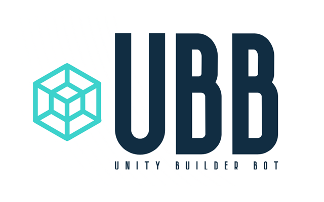

<div id="top"></div>
<!--
*** Thanks for checking out the Best-README-Template. If you have a suggestion
*** that would make this better, please fork the repo and create a pull request
*** or simply open an issue with the tag "enhancement".
*** Don't forget to give the project a star!
*** Thanks again! Now go create something AMAZING! :D
-->


<!-- PROJECT LOGO -->
<br />
<div align="center">
  <a href="https://github.com/mopsicus/unity-builder-bot">
    
  </a>

<h3 align="center">Unity Builder Bot</h3>

  <p align="center">
Telegram bot for build debug Unity projects
    <br />
    <a href="https://github.com/mopsicus/unity-builder-bot/issues">Report Bug</a>
    ·
    <a href="https://github.com/mopsicus/unity-builder-bot/issues">Request Feature</a>
  </p>
</div>


<!-- TABLE OF CONTENTS -->
<details>
  <summary>Table of Contents</summary>
  <ol>
    <li>
      <a href="#about-the-project">About The Project</a>
      <ul>
        <li><a href="#built-with">Built With</a></li>
        <li><a href="#features">Features</a></li>
      </ul>
    </li>
    <li>
      <a href="#getting-started">Getting Started</a>
      <ul>
        <li><a href="#requirements">Requirements</a></li>
        <li><a href="#installation">Installation</a></li>
        <li><a href="#options">Options</a></li>
      </ul>
    </li>
    <li>
      <a href="#usage">Usage</a>
      <ul>
        <li><a href="#commands">Commands</a></li>
      </ul>      
    </li>
    <li><a href="#roadmap">Roadmap</a></li>
    <li><a href="#contributing">Contributing</a></li>
    <li><a href="#license">License</a></li>
    <li><a href="#contact">Contact</a></li>
  </ol>
</details>


<!-- ABOUT THE PROJECT -->
## About The Project

Bot works with <a href="https://github.com/mopsicus/unity-builder-helper">Unity Builder Helper</a> (UBH). Build APK for Google/Huawei and debug IPA for iOS. Upload all files on your server and make HTML page and manifest for install APK or IPA from server.

<p align="right">(<a href="#top">back to top</a>)</p>


### Built With

* [Node.js](https://nodejs.org)
* [Telegraf.js](https://telegraf.js.org)

### Features

* Add project from Git repository
* Remove project
* List all projects
* Checkout project branch
* Update repository before build
* Build Unity project
* Build Xcode project
* Compile, archive and export to IPA with configurated manifest
* Generate HTML with install links
* Upload all objects to remote server via sshpass
* Get build logs for project
* Clear project's logs and builds

<p align="right">(<a href="#top">back to top</a>)</p>

<!-- GETTING STARTED -->
## Getting Started

Bot uses build script from Unity Builder Helper generates support files for all bot steps, but you can use your own with modifications.

### Requirements
1. Node.js
2. sshpass
3. Mac OS for building Xcode projects
4. The steady hands

### Installation

1. Create new bot via BotFather
2. Get bot token
3. Add [Unity Builder Helper](https://github.com/mopsicus/unity-builder-helper) to unity project
4. Clone the repo
   ```sh
   git clone https://github.com/mopsicus/unity-builder-bot.git
   ```
5. Install NPM packages
   ```sh
   npm install
   ```
6. Edit `.env` file

### Options

`BOT_TOKEN` Telegram bot token

`WHITE_LIST` List of users separated by comma can send commands to bot. You can get your ID by [@userinfobot](https://t.me/userinfobot)

`PROJECTS_DIR` Directory for projects

`OUTPUT_DIR` Directory for builds

`LOGS_DIR` Directory for logs

`UNITY` Path to installed Unity, i.e. /Applications/Unity/Hub/Editor/2020.3.35f1/Unity.app/Contents/MacOS/Unity

`BUILD_METHOD` Method in [Unity Builder Helper](https://github.com/mopsicus/unity-builder-helper). It will build project and support files for bot.

`TIMEOUT` Timeout for Git and other shell operations

`REMOTE_PATH` Url for downloading builds, i.e. https://mopsicus.ru/builds

`IOS_TEAM` Your iOS Team ID for signing Xcode project

`SSH_LOGIN` SSH login

`SSH_PASS` SSH password

`SSH_HOST` Host for uploading files

`SSH_PATH` Path on host for storing files, i.e. ~/domains/mopsicus.ru/builds/

<p align="right">(<a href="#top">back to top</a>)</p>


<!-- USAGE EXAMPLES -->
## Usage

When you run `Remote build` from Unity, bot show message with command and button to run it. Bot will get updates from repo, build and upload files to your server, after that notify you with link to download.

1. Run bot (i.e. `pm2` or `node index.js`)
2. See all commands via `/help` command
3. Add project to bot
4. Open UBH in Unity Editor via hotkey `cmd+g` or menu
5. Paste your Telegram user ID 
6. Run remote build 

### Commands
`/add <repository url> <branch>` Add project to bot and checkout branch

`/remove <project name>` Remove project

`/checkout <project name> <branch>` Checkout git branch

`/build <project name> <branch> <platform> <defines>` Build project and upload to host

`/log <project name> <platform> <type>` Get log files

`/clear <project name>` Clear builds and logs

`/list` Request projects list

`/help` Show commands list

<p align="right">(<a href="#top">back to top</a>)</p>

<!-- ROADMAP -->
## Roadmap

- [ ] Add WebGL build
- [ ] Add iOS production build
- [ ] Add upload to AppStore

See the [open issues](https://github.com/mopsicus/unity-builder-bot/issues) for a full list of proposed features (and known issues).

<p align="right">(<a href="#top">back to top</a>)</p>


<!-- CONTRIBUTING -->
## Contributing

Contributions are what make the open source community such an amazing place to learn, inspire, and create. Any contributions you make are **greatly appreciated**.

If you have a suggestion that would make this better, please fork the repo and create a pull request. You can also simply open an issue with the tag "enhancement".
Don't forget to give the project a star! Thanks again!

1. Fork the Project
2. Create your Feature Branch (`git checkout -b feature/AmazingFeature`)
3. Commit your Changes (`git commit -m 'Add some AmazingFeature'`)
4. Push to the Branch (`git push origin feature/AmazingFeature`)
5. Open a Pull Request

<p align="right">(<a href="#top">back to top</a>)</p>


<!-- LICENSE -->
## License

Distributed under the MIT License. See `LICENSE` file for more information.

<p align="right">(<a href="#top">back to top</a>)</p>


<!-- CONTACT -->
## Contact

Mopsicus: mail@mopsicus.ru

Website: https://mopsicus.ru

Telegram: https://t.me/mopsicus 

Project Link: [https://github.com/mopsicus/unity-builder-bot](https://github.com/mopsicus/unity-builder-bot)

<p align="right">(<a href="#top">back to top</a>)</p>
